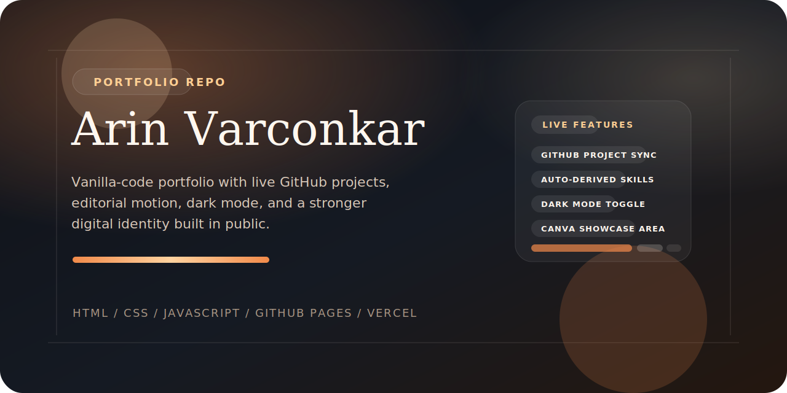
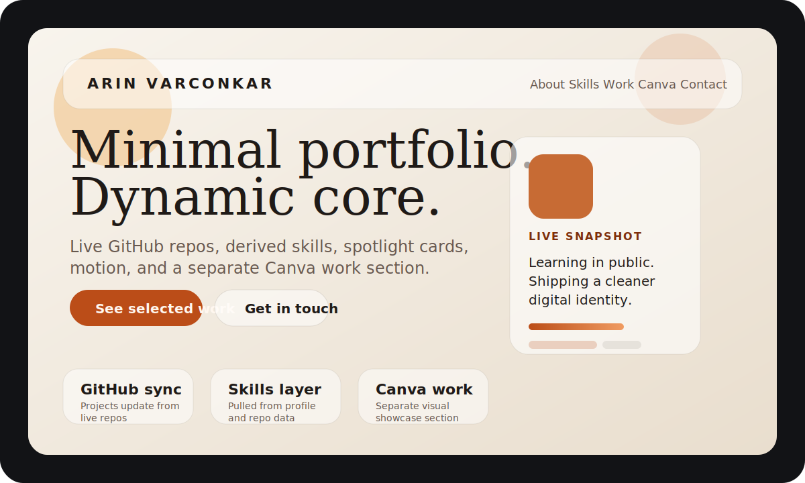

<div align="center">
  
</div>

<div align="center">

### A premium personal portfolio with live GitHub projects, editorial motion, dark mode, and a growing digital identity.

[](https://arinXcodes69.github.io/Portfolio/)
[](https://arin-varconkar-portfolio.vercel.app/)
[](#)
[](#)
[](#)

</div>

---

## The Vibe

This is not a plain resume page and not a generic portfolio template.

It is built to feel:

- cinematic
- clean
- modern
- warm
- dynamic
- personal

The goal is to make the repo page and the live site both feel like they belong to the same visual world.

---

## Live Experience

- GitHub Pages: [arinXcodes69.github.io/Portfolio](https://arinXcodes69.github.io/Portfolio/)
- Vercel: [arin-varconkar-portfolio.vercel.app](https://arin-varconkar-portfolio.vercel.app/)

---

## Visual Preview

<div align="center">
  
</div>

---

## What Makes This Portfolio Different

### 1. Live GitHub-Powered Projects
The portfolio pulls public repositories into the projects section so the site feels more connected to real work than static placeholder cards.

### 2. Auto-Derived Skills
Skills are inferred from profile content and repository data, making the site more adaptive and less manually repetitive.

### 3. Premium Minimal UI
The design aims for an Apple-meets-Stripe mood with soft depth, editorial spacing, warm gradients, and cleaner motion.

### 4. A Separate Canva Showcase
Creative work is not buried inside generic project cards. Canva designs have their own section so they can grow like a real visual portfolio.

### 5. Dark Mode With Personality
The dark theme is not an afterthought. It has its own proper surfaces, contrast, overlays, and motion treatment.

---

## Feature Stack

```text
• Sticky navbar
• Smooth scrolling
• Scroll reveal animations
• Theme toggle with persistence
• GitHub repo sync
• Auto-built skills section
• Spotlight project modal
• Canva projects section
• Auto-updating age
• Responsive layout for desktop and mobile
• SEO / Open Graph / manifest / robots / sitemap
```

---

## Built With

- HTML5
- CSS3
- Vanilla JavaScript
- Google Fonts

No framework layer.
No React.
No heavy build system.
Just a polished static portfolio with dynamic client-side behavior.

---

## Structure

```text
.
├── .github/workflows/deploy-pages.yml
├── assets/
│   ├── readme-banner.svg
│   └── readme-preview.svg
├── index.html
├── styles.css
├── script.js
├── favicon.svg
├── og-preview.svg
├── robots.txt
├── sitemap.xml
├── site.webmanifest
└── README.md
```

---

## Core Sections In The Site

- Hero
- About
- Focus
- Skills
- Education
- Projects
- Canva Projects
- Notes
- Contact

---

## Code Highlights

### `script.js`
Handles the full dynamic content layer:

- app rendering
- GitHub repo fetching
- skill extraction
- project spotlight logic
- theme persistence
- live time and rotating hero content
- age automation

### `styles.css`
Controls the full visual identity:

- day and night themes
- hero styling
- motion
- card system
- modal behavior
- responsive layout
- portfolio atmosphere

### `index.html`
Keeps the app shell lightweight while handling:

- SEO metadata
- Open Graph tags
- Twitter card tags
- JSON-LD schema
- manifest and favicon hooks

---

## Why This Repo Exists

This repository is designed to grow with Arin Varconkar over time.

It is not meant to freeze as a one-time college portfolio.
It is meant to expand as:

- new GitHub projects appear
- new Canva work gets added
- stronger skills develop
- better project stories replace early placeholders

---

## Connect

- Email: [varconkararin08@gmail.com](mailto:varconkararin08@gmail.com)
- GitHub: [github.com/arinXcodes69](https://github.com/arinXcodes69)
- LinkedIn: [linkedin.com/in/arin-varconkar0825](https://www.linkedin.com/in/arin-varconkar0825)

---

<div align="center">

### Built to feel like a real digital presence, not just a student submission.

</div>
